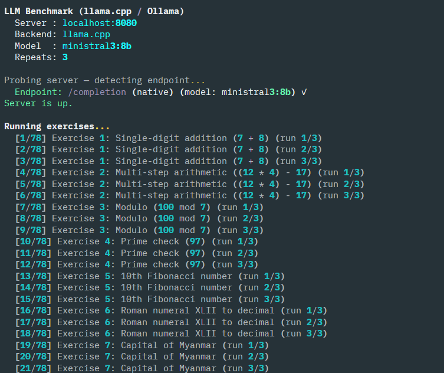
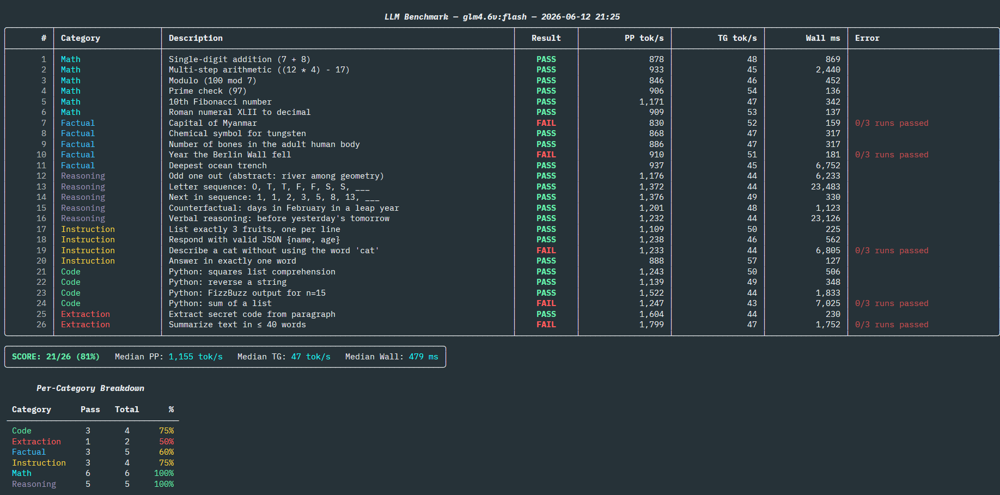
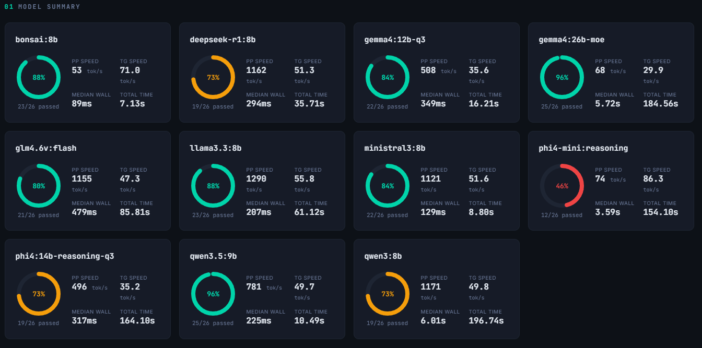
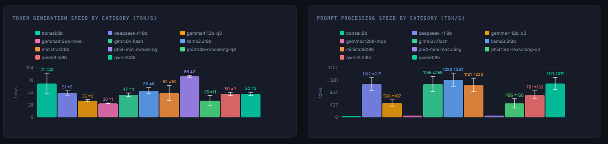

# Python Llama Benchmarking Script

A Python script to benchmark local AI models served by [llama.cpp](https://github.com/ggml-org/llama.cpp) or [Ollama](https://ollama.com/).

It runs a suite of 25+ verifiable exercises against a model and reports both **accuracy** (e.g. `23/26 passed`) and **performance** (prompt-processing speed, token-generation speed, wall time, and total runtime).

Coded with assistance from Claude (Sonnet 4.6, Opus 4.6 and 4.8). See [PLAN.md](PLAN.md) for the full design that drove the implementation.

## The Prompt

This project started from a single prompt to Claude:

> Generate a plan for a python script that will help benchmark local AI models running llama.cpp. I'll be running the server and want to capture things like prompt-processing and token generation speeds, as well as total execution time. I want the script to have a series of exercises, at least 20, that it runs through with verifiable results so it can output success metrics, like 14/20 pass or something like that.

It took a few tries because I use the `--models-preset` flag when running llama.cpp, so it behaves more like a router.

## Install

Requires [`uv`](https://github.com/astral-sh/uv).

```bash
uv sync                       # install dependencies
source .venv/bin/activate     # activate the environment
```

## Usage

Discover models to use
```bash
python llama_bench.py --list-models
```

Basic run (server on localhost:8080)
```bash
python llama_bench.py --model mistral-7b
```

Benchmark an Ollama server (defaults to localhost:11434)
```bash
python llama_bench.py --ollama --model llama3
```
The `--ollama` flag activates the Ollama endpoints (`/api/chat`) and defaults the port to `11434`. Without it, the llama.cpp endpoints are used.

Filter to just math and code, run each 3 times (reports median)
```bash
python llama_bench.py --model llama3 --categories Math,Code --repeat 3
```

Save results to JSON, verbose mode
```bash
python llama_bench.py --model phi3 --output results.json --verbose
```

List all exercises
```bash
python llama_bench.py --list
```

Get full error message
```bash
python llama_bench.py --diagnose
```

## What a Run Looks Like

The script probes the server, detects the endpoint, then streams progress as each exercise runs:



When finished it prints a per-exercise results table with pass/fail, speeds, wall time, and any errors, plus a category breakdown:



## HTML Report

Generate a combined HTML report across all saved JSON runs:

```bash
python bench_report.py
```

This writes `bench_report.html` with per-model summary cards:



and comparative speed charts by category:



## My Results

The [`results/`](results/) folder holds the JSON output from my own runs. 
These were generated with the following calls and then moved from `data` to `results` for safekeeping:
```bash
python llama_bench.py --model gemma4:12b-q3 --output data/gemma4-12b-q3.json --repeat 3
python llama_bench.py --model qwen3.5:9b --output data/qwen3.5-9b.json --repeat 3
python llama_bench.py --model qwen3:8b --output data/qwen3-8b.json --repeat 3
python llama_bench.py --model llama3.3:8b --output data/llama3.3-8b.json --repeat 3
python llama_bench.py --model gemma4:26b-moe --output data/gemma4-26b-moe.json --repeat 3
python llama_bench.py --model deepseek-r1:8b --output data/deepseek-r1-8b.json --repeat 3
python llama_bench.py --model glm4.6v:flash --output data/glm4.6v-flash.json --repeat 3
python llama_bench.py --model ministral3:8b --output data/ministral3-8b.json --repeat 3
python llama_bench.py --model phi4-mini:reasoning --output data/phi4-mini-reasoning.json --repeat 3
python llama_bench.py --model phi4:14b-reasoning-q3 --output data/phi4-14b-reasoning-q3.json --repeat 3

# With a different version of llama.cpp (see https://github.com/PrismML-Eng/Bonsai-demo/):
python llama_bench.py --model bonsai:8b --output data/bonsai-8b.json --repeat 3
```

## License

BSD 3-Clause License. Copyright (c) 2026, David Rodriguez. See [LICENSE](LICENSE).
